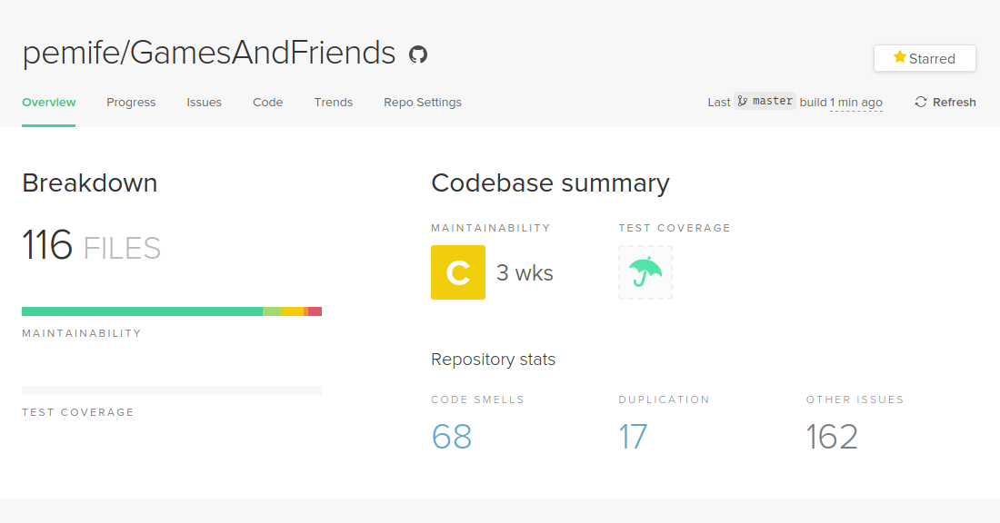
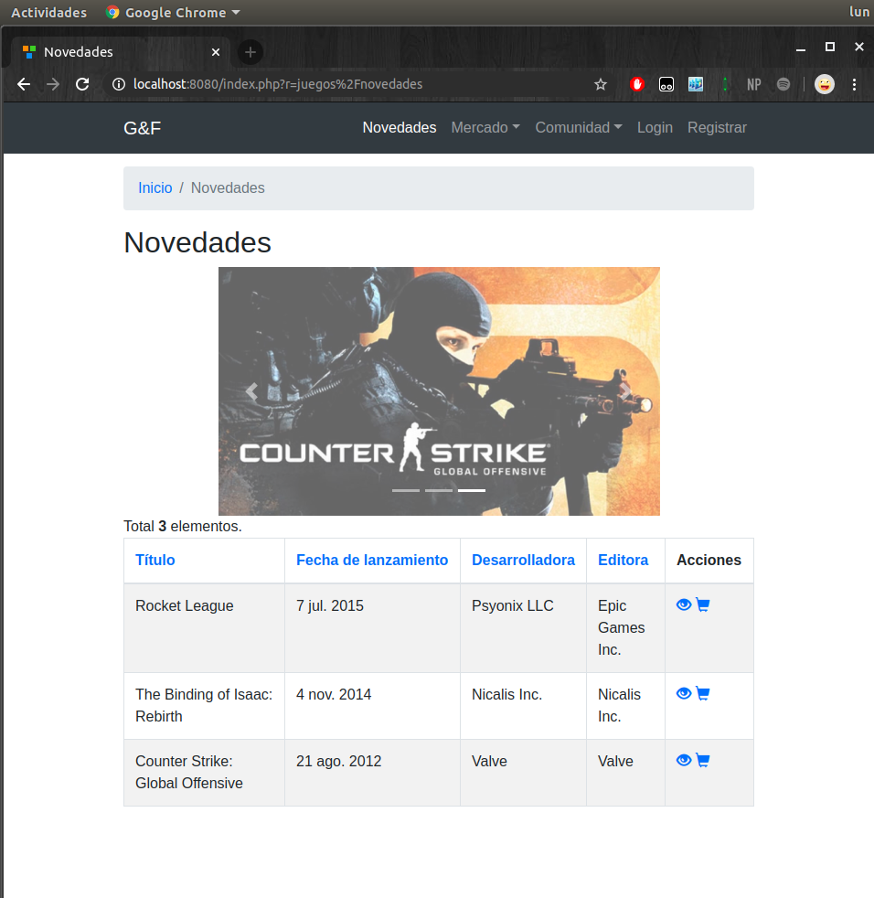
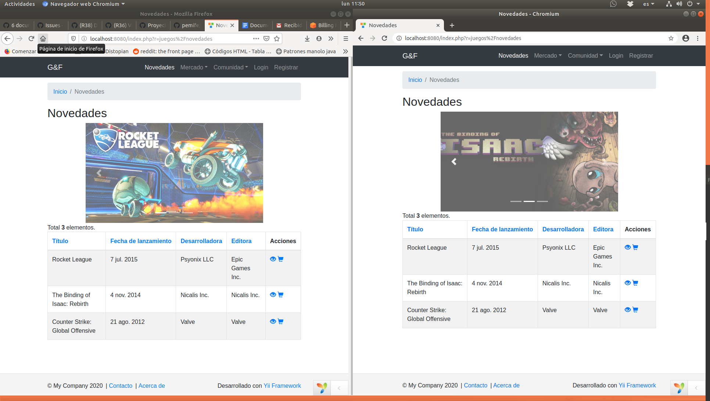
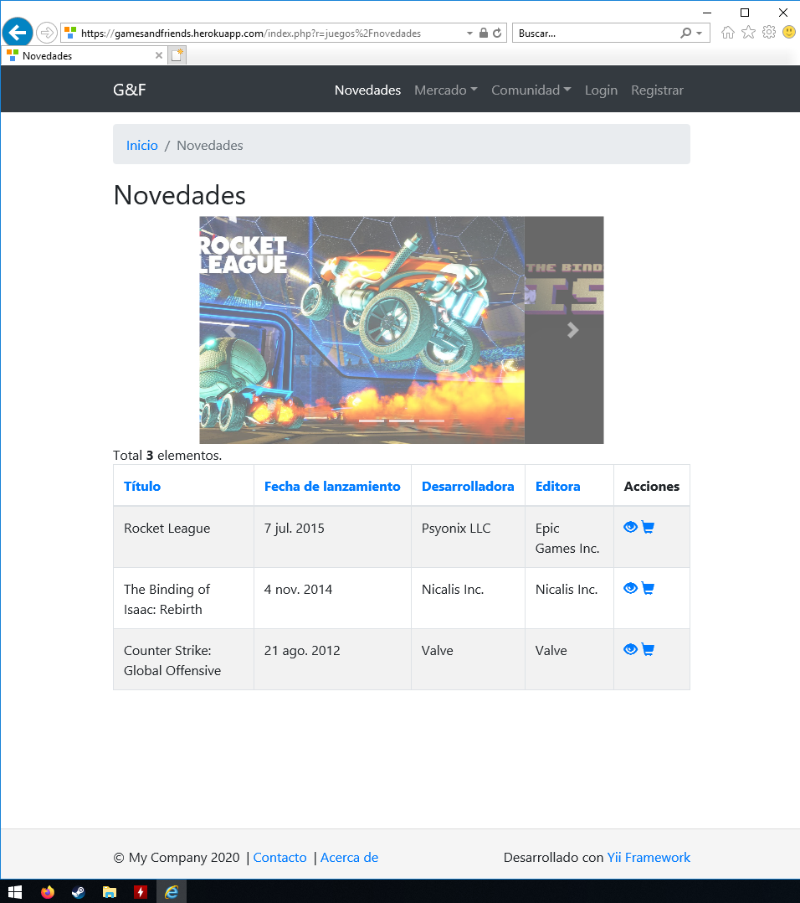
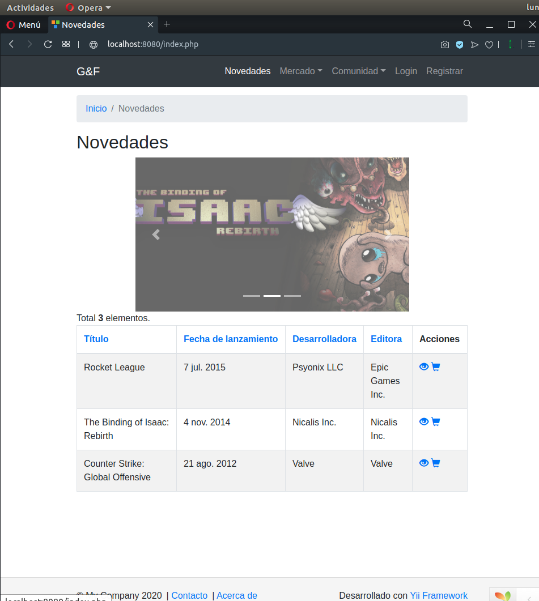
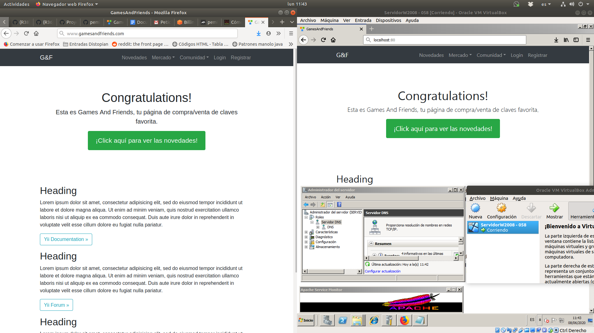
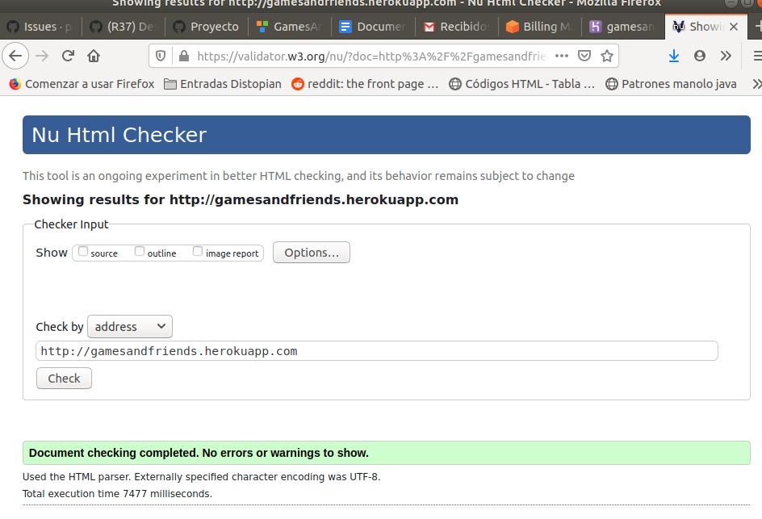

# Anexos

**([RF26](https://github.com/pemife/GamesAndFriends/issues/26)) Code Climate**

Estado del código -según Code Climate- con una mantenibilidad de rango C de tres semanas.

---

**([RF36](https://github.com/pemife/GamesAndFriends/issues/36)) Varios Navegadores**

Capturas de ejemplo para ver el diseño compatible con cada navegador.

#### *Google Chrome*

---

#### *Firefox y Chromium*

---

#### *Internet Explorer*

---

#### *Opera*

---

**([RF38](https://github.com/pemife/GamesAndFriends/issues/38)) Despliegue local**

---

**([RF34](https://github.com/pemife/GamesAndFriends/issues/34)) Validación html3, css3 y accesibilidad**

[Enlace validación](https://validator.w3.org/nu/?doc=http%3A%2F%2Fgamesandfriends.herokuapp.com)

---

### *Prueba del seis*

 1. ¿Qué sitio es este?
- _GamesAndFriends_ tiene una **barra de navegación**, la cual se encuentra siempre fijada en la parte
más alta de la página, de la manera mas cómoda, para saber siempre de que página se trata. El **logo**,
que siempre esta fijado en la parte superior izquierda, permite verlo en todo momento.

 2. ¿En que página estoy?
- En todas las páginas a las que se puede acceder en _GamesAndFriends_, hay un widget que expone
las **migas de pan**, que muestran el camino que hemos seguido para llegar a donde estamos.

 3. ¿Cuáles son las principales secciones del sitio?
- La página se divide principalmente en **Mercado**, **Comunidad** y **Usuarios**.

 4. ¿Qué opciones tengo en este nivel?
- Como usuario, puedes poner en venta un producto o copia de juego. A su vez, puedes crear posts
para hablar de videojuegos u opinar sobre estos o cualquier producto que tengas en tu inventario. Puedes
hacerte crítico -dejando opiniones de calidad- o seguir a usuarios que lo sean. Por último, puedes hacerte amigo de los
usuarios participantes de la web.

 5. ¿Dónde estoy en el esquema de las cosas?
- Siempre hay un widget que muestra el camino que has recorrido para llegar hasta donde estés.

 6. ¿Cómo busco algo?
- Entrando en el apartado de lo que quieras buscar -Mercado, Comunidad o Usuarios- se pueden encontrar barras de búsqueda en su interior.
