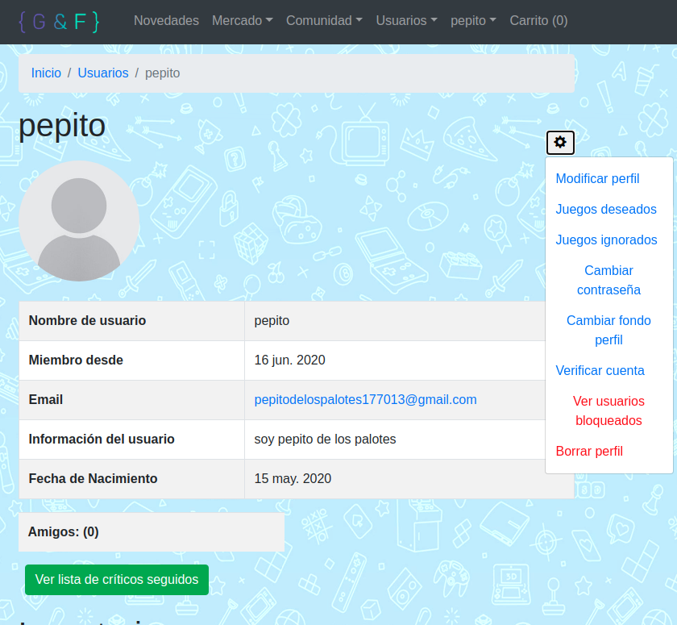

# Manual de usuario

## Registro:

Esta es la página principal de GamesAndFriends

Para registrarnos, debemos acceder al boton de la esquina arriba a la derecha "Registrar".
Aparecerá un formulario como este:

Un formulario completado de ejemplo, seria este:

Al guardar el formulario, se crea el perfil de usuario, y envía un correo de bienvenida/verificación al correo del nuevo usuario:

Si omitimos el paso de verificar nuestra cuenta con el enlace presente en el correo de bienvenida, siempre podremos enviar otro correo de verificación con la siguiente opción:

Al pulsar en la opción de verificar usuario, enviará otro correo a la cuenta, esta vez, diferente:

Al pulsar el enlace de verificación de usuario, tanto en el email de bienvenida como el de verificación de usuario, se redirige de vuelta a la página inicial, con un mensaje informando al usuario de que su cuenta ha sido verificada:

## Crear cuenta de PayPal Sandbox

El primer paso es iniciar sesión o registrarse en PayPal. Lo siguiente es acceder al apartado de programador de paypal:

Lo siguiente será acceder al apartado de la API:

Iniciar sesion en el "Dashboard":

Crear app:

Ponerle nombre, y crear. Al finalizar, tendrás la dirección de correo y token de usuario que debes usar para realizar transacciones simuladas.

## Comprar un juego de primera mano:

Iniciamos sesión:

Acceder al índice de Juegos:

Elegir el juego de preferencia:

Elegir plataforma de preferencia:

Acceder al carrito (que contiene el juego y plataforma de preferencia):

Pulsar el boton de pago con paypal:

Iniciar sesión con cuenta de Sandbox:

Finalizar pago:

Saldrá un mensaje de aviso de compra completada:

La copia nueva, se encuentra en el inventario:

## Poner copia/producto en venta

Iniciamos sesión:

Añadir a inventario:

Elegir:

Este es el formulario de juegos:

Este es el formulario con la clave de juego que se quiere vender:

Este es el formulario de productos:

Este es el formulario con la descripción del producto que se quiere vender:

Vemos la copia/producto recién creado, con un boton de "poner en venta", lo pulsamos:

Por último, le ponemos precio, y finalizamos.

Esta sería la venta creada:

